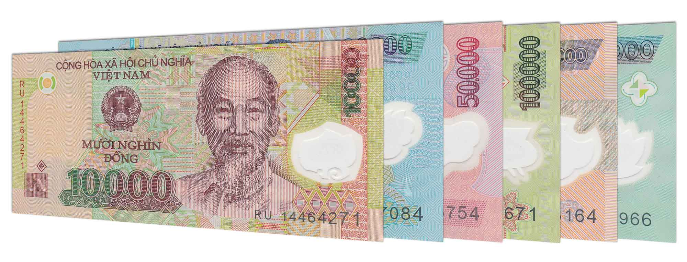

# Overview



In this project,I implement a classifier for the currency of Vietnam,the Vietnam Dong  (VND).The idea is a Flask app that user can capture an image of VND note which could be 1k,2k,5k,10k,20k,50k,100k,200k and 500k (9 classes) and then the app will recognize the value of the note

The technical problems to solve :
- How to train a deep learning model to classify the note ?
- How to build a Flask app ?
- How can a user capture photos on the web ?
- How to store the images that users submit ?

# Modeling
The model was trained on 1675 images:
| Note value | #image |
| -----------| -------|
|   1000     |  68    |
|   10000    |  164   |
|   100000   |  200   |
|   2000     |  176   |
|   200000   |  185   |
|   5000     |  253   |
|   50000    |  219   |
|   500000   |  207   |

Pre-trained model : `tf.keras.applications.MobileNetV2`

Fine-tuning at layer 140

Model summary:
```
Model: "sequential_18"
_________________________________________________________________
Layer (type)                 Output Shape              Param #   
=================================================================
mobilenetv2_1.00_192 (Model) (None, 6, 6, 1280)        2257984   
_________________________________________________________________
global_average_pooling2d_18  (None, 1280)              0         
_________________________________________________________________
dense_18 (Dense)             (None, 9)                 11529     
=================================================================
Total params: 2,269,513
Trainable params: 1,051,529
Non-trainable params: 1,217,984
```

Validation accuracy: 88.54%

# Run flask app
Run app by command `python main.py`
